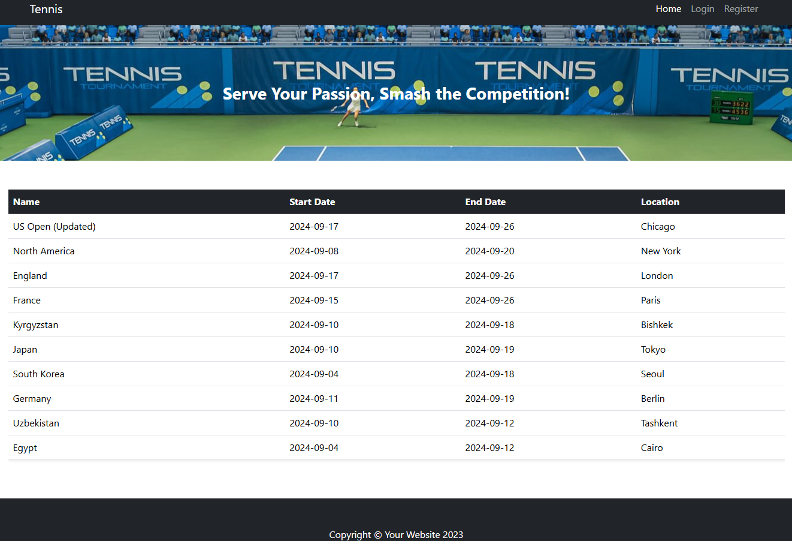

# Tennis Tournaments

## Overview

Tennis Tournaments is a full-stack web application designed to manage tennis tournaments with role-based access. The system supports two types of users:

- **Tennis Players**:  
  - Can register or unregister for upcoming tournaments after logging in.

- **Administrators**:  
  - Have access to a secure admin panel to create, update, or delete tournament events.

Additionally, all users can view a public list of upcoming tournaments without logging in.

## Features

- ✅ Role-based access control using Spring Security  
- ✅ Player registration and unregistration for tournaments  
- ✅ Admin panel for tournament management (CRUD)  
- ✅ Public and private views rendered with Thymeleaf  
- ✅ Responsive UI styled with Bootstrap  
- ✅ Input validation and error handling

## Technologies Used

- Java 17  
- Spring MVC  
- Spring Security  
- Maven  
- Thymeleaf  
- Bootstrap

### Tournament List Page


## Getting Started

1. Clone the repository:
   ```bash
   git clone https://github.com/your-username/tennis-tournaments.git
   cd tennis-tournaments
